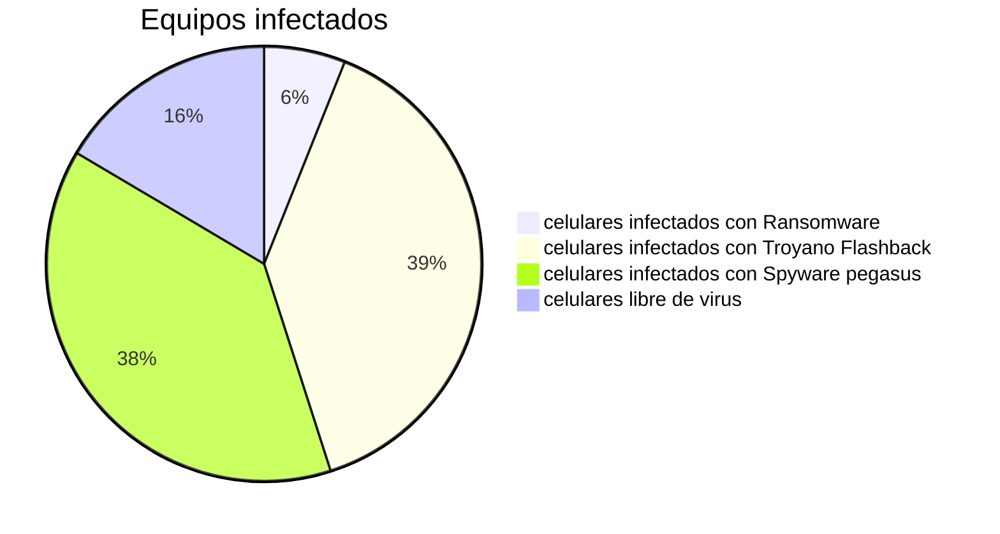

#                           Informe de analisis de ransomware

 
## Resumen ejecutivo: 
 **Este informe tiene como objetivo concientizar y establecer un plan de acción que permita tener conocimientos de cómo funciona, cómo se puede evitar y qué medidas de de seguridad adoptar para dar mayor seguridad a los datos tanto personales como empresariales.**
                  
 ## Introducción:

 **En un ciber Ubicado en calle quinta con avenida valparaíso se presentó un caso de infección masiva de celulares mediante el uso y propagación de un Malware de tipo “RANSOMWARE”, tipo de malware que tiene como objetivo encriptar información, en otras palabras roba la información de una unidad de almacenamiento y la bloquea mediante un método de cifrado, lo que hace imposible el acceso a la información de los usuarios si no es con la clave asignada por el creador del ransomware.**

## Antecedentes del caso:
 **Un trabajador X, que por supuesto fue desvinculado fue desvinculado de 
 de la empresa, por malas prácticas, se venían reportando desde ya varios días denuncias por parte de los clientes que en su mayoría eran personas que solían ir bien seguido a dicho Ciber por sus servicios variados, entre esos servicios La reparación de telefonía celular, donde el atacante tenía acceso a información de los clientes extrayendo su información de contacto revisando los logs de mails a través de esa información el atacante aprovechaba de enviar “correos spam” a los distintos clientes que frecuentaban el lugar, la infección ocurría cuando los lientes arrendaban el uso de un computador donde normalmente en su estadía dentro del establecimiento era con el fin de revisar sus correos, entonces el atacante
 Enviaba un archivo apk de android, con la excusa de que era un programa de antivirus algunas personas por ignorancia caían y luego en el mismo ciber el atacante venía la solución.**

## Objetivos del análisis
 **Identificar el tipo de ataque**

 **Determinar el alcance del compromiso de los datos expuestos**

 **Evaluar el rango de impacto del incidente en la reputación y continuidad del negocio**

 **Prevenir más ataques de este tipo en el futuro**

## Metodología del análisis
 **En este caso las herramientas que usaremos para el análisis del Malware Ransomware Podrían ser consideradas Ghidra, Virus total, Hybrid Analisis y Any.run**

## Procedimiento: 
 **preparar un entorno de trabajo para el análisis, un entorno seguro y con una amplia variedad de herramientas para esta labor podría ser Kalilinux, ya que trae por defecto algunas de las herramientas ya mencionadas.**

                                         
##                                     Análisis

 **En el siguiente análisis mostraremos algunas de las muestras y evidencias del comportamientodel malware.**

---

---

 **En las imágenes podemos apreciar que el código fuente tiene algunas funciones que son bastante sospechosas debido a que requieren de permisos de administrador, lo cual es una mala práctica ya que conceder estos permisos puede surgir la posibilidad de que la APK Malware se apodere por 
 completo del dispositivo y sus datos personales.**

---

## Evaluación de impacto:
 **según nuestro estudio el nivel de daños que podría causar este tipo de Malware es de carácter Muy peligroso, debido a que tiene características de su uso que hacen que se apodere de los sistemas y sus datos, no solo roba los datos sino que los encripta mediante herramientas de cifrado con la única intención de cobrar un rescate por los archivos secuestrados.**

---

## Grafico con equipos de la empresa

---

## Medidas de resguardo y seguridad: 
 
**Instruir al personal sobre las amenazas del Ciberespacio** 
               
**Documentar los casos de infección para elaborar planes de estudio y concientización**
               
**Realizar actualizaciones para mitigar la compatibilidad de estas amenazas mediante parches de actualización**
               
**Realizar pruebas de análisis para tener una mejor comprensión acerca de cómo actuar contra estas amenazas.**
               
**Guardar Registros e Informes para posibles estudios y ensayos de seguridad**

## Recomendaciones

**Nunca estará de más hacer charlas para instruir y concientizar al personal, siempre mantener los equipos informáticos siempre actualizados, nunca instalar programas o aplicaciones de terceros nunca abrir archivos recibidos de correos y menos de personas a quienes nunca dimos nuestro correo electrónico. Nunca permitir que personal no autorizado haga intrusión ni uso de los dispositivos o equipos informáticos**

## Conclusion

**Este informe destaca la importancia de estudiar y entender el malware, en particular el ransomware, para anticipar y prevenir los ataques cibernéticos que buscan vulnerar y robar datos confidenciales de los clientes. Actualmente, el ransomware es una herramienta utilizada en ataques de phishing que no solo emplea ingeniería social para obtener datos, sino que también puede secuestrar información de manera temporal o permanente. Sin una adecuada protección, esto puede resultar en la pérdida de datos críticos para las empresas y en pérdidas económicas significativas.**

**La realización de exámenes exhaustivos de estas amenazas es esencial para identificar soluciones y garantizar la seguridad de los datos. Dado que el malware no respeta barreras ni fronteras y su propagación es impredecible, este informe ofrece una base para desarrollar medidas de seguridad más efectivas, planes de concientización y programas de capacitación para el personal. Estas acciones contribuirán significativamente a la mitigación de riesgos y a la protección contra futuras amenazas cibernéticas.**

