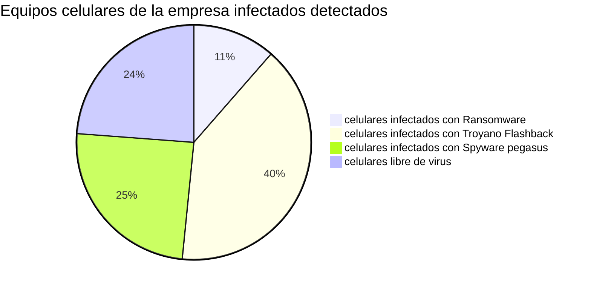
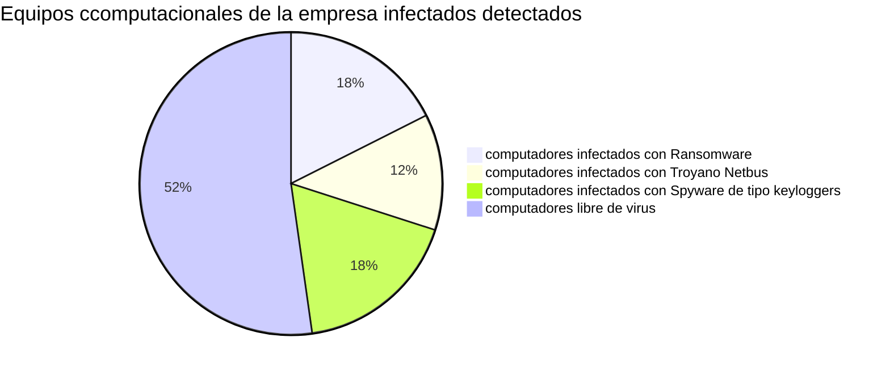

#                           Informe de analisis de ransomware

### Empresa: Servitech
### Nombre: David Durán
### Ocupacion: Soporte Técnico Servitech
### Fecha: 12/08/2024

## Resumen ejecutivo: 
 **En este informe está el trabajo investigativo realizado por nuestro equipo de trabajo Soporte Técnico Servitech, empresa dedicada a la reparación de celulares, este informe es parte de un exhaustivo analisis realizado debido a un Ciberataque producido hace una semana atrás, donde la magnitud del ataque deja como resultado muchos equipos informaticos y bases de datos resultaron infectados y con perdidas significativas, Servitech ofrece su servicio de soporte para realizar pruebas que ayuden a restaurar información de los equipos comprometidos y tambien recolectar información que sirva de evidencia para poder dar con los responsables del ataque y procesarlos por delitos informáticos.**

                  
 ## Introducción:

 **Este documento contiene los detalles del procedimiento del análisis forense realizado por el personal de Servitech en el presente docuemnto veremos un breve resumen de los hechos que dieron paso a esta investigación, como tambien mostrar el procedimiento empleado por elquipo de servicio técnico, metodologías y herramientas utilizadas.**

## Antecedentes del caso:
 **El Fondo Conjunto de Cooperación Chile-Mexico ha financiado un proyecto de seguridad cibernética enfocado en la proteccion de infraestructuras críticas.**
 **Durante la fase de implementación, una de las infraestructuras críticas del proyecto ha sufrido un ataque cibernético significativo. Como parte del equipo de respuesta, se recomienda a los estudiantes realizar un análisis forense exhaustivo para identificar las vulnerabilidades explotadas, recolectar evidencias y determinar la extensión del compromiso, la mision del equipo de servitech es aportar con la investigacion y asegurar que su empresa no fue afectada con este super ataque masivo informático**

## Objetivos del análisis
 **-Identificar el tipo de ataque**

**-Recuperar informaión critica, restablecer la operatibilidad de los Servicios**

**-Determinar el alcanse del compromiso de los datos expuestos**

**-Evaluar el rango de impacto del incidente en la reputación y continuidad del negocio o empresa afectada**

**-Prevenir en el futuro más ataques de este tipo realizando un plan estrategico de proteccion de datos**

**-Elaborar un informe de caracter instructivo, informativo para la concientizacion del personal**

## Metodología del análisis
 **La metodología apliacada por el personal Servitech durante el proceso investigativo fue realizar la toma de evidencia y material incriminatorio y hacer una copia de respaldo, manteniendo la integridad del material encontrado, las evidencias son rapidamente respaldadas bajo documentacion escrita y con las instrucciones del procedimiento investigativo. Las evidencias originales se guardan y las copias son analizadas tanto de manera estatica como de forma dinámica, esto consiste en utilizar herramientas de Analisis como Autopsy o Ghidra, esenciales para poder realizar pruebas de ingenieria inversa como tambien poder hacer el rescate de informacion Crítica**

## hallazgos:

**En el siguiente grafico tenemos un resumen de los detalles del ciber ataque
donde se comprueba eel alcanse del daño y los equipos comprometidos**
# Grafico con equipos de la empresa

---

                                
## Análisis:

 **Nuestro analisis Consiste de la siguiente toma de imagenes donde exponemos la revisión de nuestros sistemas**

**En la primera imagen estamos mostrando La herramienta Wireshark para hacer una Auditoria que consiste en realizar un escaneo del trafico de la red**

**En la segunda imagen podemos ver parte del procedimiento, usando la terminal para abrir Nmap y proceder a ingresar la Ip para una revision de sus puertos** 

**en la tercera imagen tenemos una revision usando Nmap herramienta que ayuda a explorar los puertos de una red y determinar si la red ha sufrido algun ataque que comprometa servicios y datos sensibles a traves de los puertos habilitados, lo que puede significar una amenaza si no se tiene considerado una revision de los sistemas en sus protocolos de red**

**Finalmente una revision a nuestro sistema usando ghidra, para asegurarnos que los programas, archivos ydatos de nuestros servicios, esten asegurados fuera de la manipulacion de terceros usando esta herramienta para una revisión mas profunda y detallada revisando un par de malware hallados durante el escaneo**

 

## Evaluación de impacto:
 **De acuerdo a nuestra revisión podemos argumentar que hasta el momento el analisis realizado por el servicio tecnico Servitech, comprueba que su empresa no esta comprometida con el ataque, lo que quiere decir que su sistema esta limpio, y listo para proceder en prestar ayuda con auditorías para otras empresas para ayudar a salir de la emergencia del ataque cibernetico a gran escala**
 **Afortunadamente Servitech sale ileso del ataque debido al uso de una herramienta tan sencilla como Deepfreeze que ayuda a proteger la informacion mediante el congelamiento del sistema**

---

## Conclusión

**Este informe destaca la importancia de estudiar y entender los ataques informaticos, espesificando como y de que manera los ciberdelincuentes pueden realizar ataques usando herramientas tales como malware y ransomware, los cuales a travez de técnicas como la ingenieria social pueden causar destrosos, vulnerar y robar datos confidenciales de los clientes. Actualmente, el ransomware es una herramienta utilizada en ataques de phishing que no solo emplea ingeniería social para obtener datos, sino que también puede secuestrar información de manera temporal o permanente. Sin una adecuada protección, esto puede resultar en la pérdida de datos críticos para las empresas y en pérdidas económicas significativas.**

**La realización de exámenes exhaustivos de estas amenazas es esencial para identificar soluciones y garantizar la seguridad de los datos. Dado que el malware no respeta barreras ni fronteras y su propagación es impredecible, este informe ofrece una base para desarrollar medidas de seguridad más efectivas, planes de concientización y programas de capacitación para el personal. Estas acciones contribuirán significativamente a la mitigación de riesgos y a la protección contra futuras amenazas cibernéticas.**

## Recomendaciones

**Nuestro equipo y soporte Técnico aconsejan siempre tomar medidas de resguardo y seguridad para mantener los equipos informaticos siempre protegidos ante cualquier amenaza, empleando varias herramientas y técnicas de configuración**

**-Mantener equipos informaticos siempre Actualizados**

**-Realizar monitoreo y revisiónes exhaustivas a la red, usando las herramientas necesarías y adecuadas**

**-Documentar y archivar todo el estudio y avance**

**-No Utilizar programas Crackeados, pirateados, ni usar programas con licencias falsas**

**-Proteger las redes usando Firewalls de hardware y software**

**-El respaldo constante de la informaíon Critica usando todos los medios y recursos**

**-Usar herramientas de cifrado**

